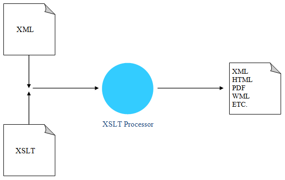
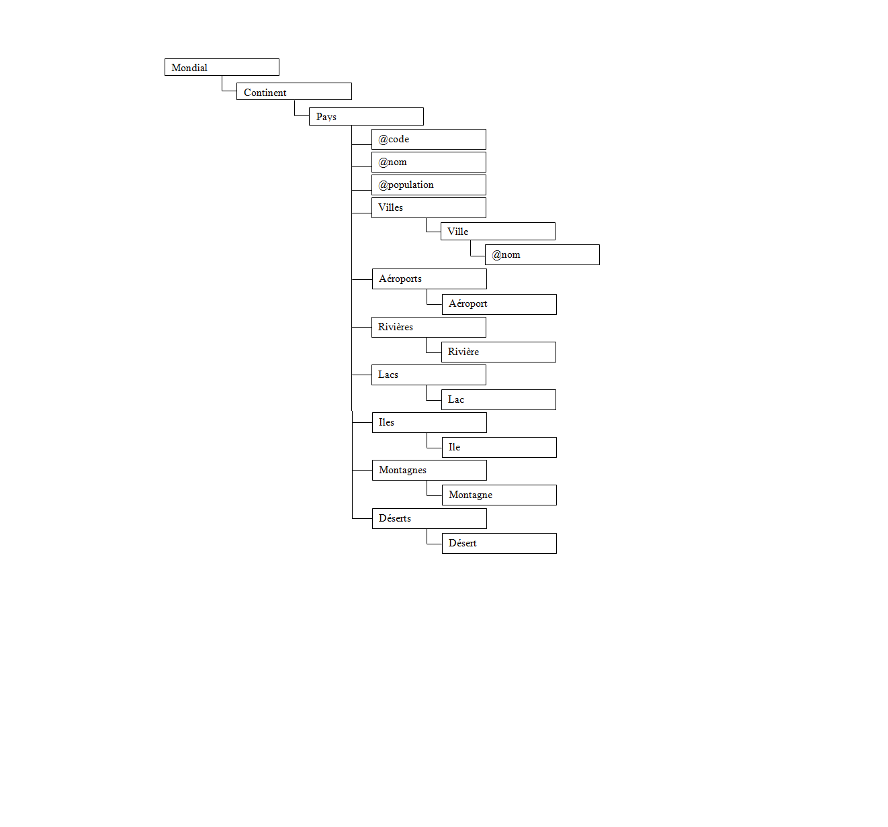

# TP2_XSL
## Exercice 1

>Cet execice permet de transformer le fichier [mondial.xml](https://www.dbis.informatik.uni-goettingen.de/Mondial/mondial.xml) en utilisant XSL vers un fichier html selon l'architecture suivante :

